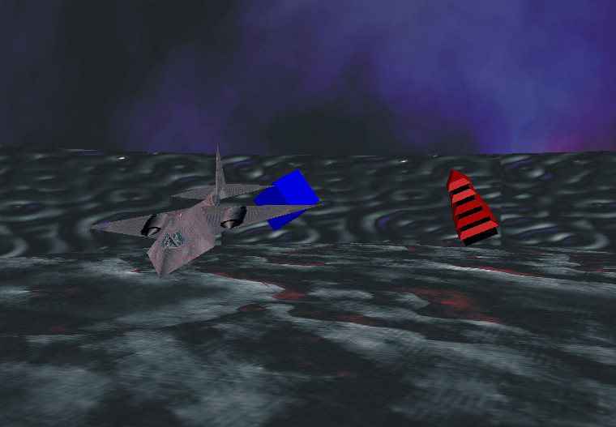
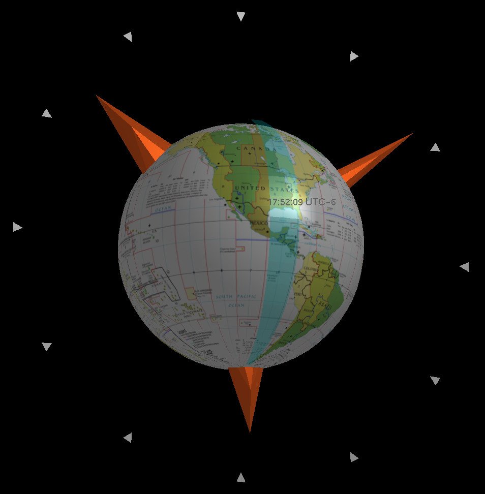

# OpenGL
A collection of small OpenGL exercises developed in C during an undergraduate course in 2005.

The EXE files have been tested in Windows 8 (64 bits) and Windows XP (32 bits).

Some 3D scenes can be navigated with the arrow keys and others dragging the mouse. In some scenes, you can also press F or G to go upwards or downwards.

## Animations

## House

## World clock

