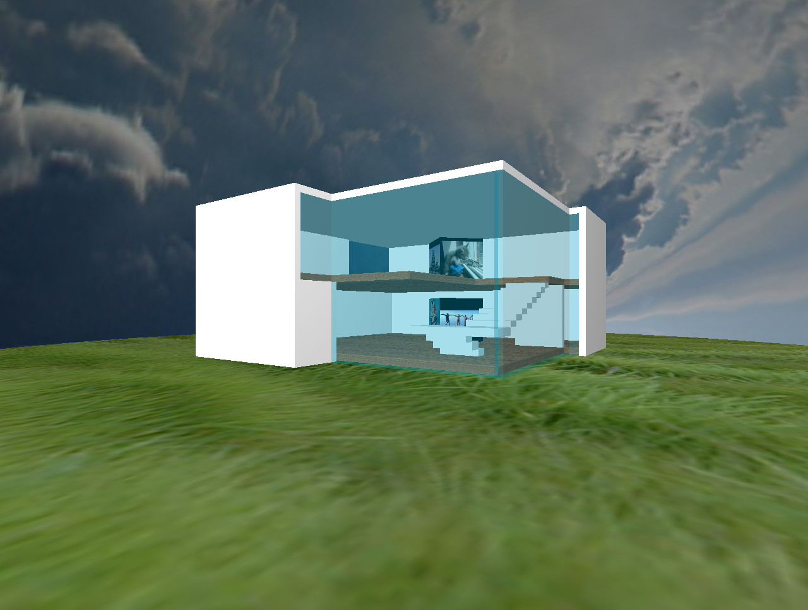

# OpenGL
A collection of small OpenGL exercises developed in C during an undergraduate course in 2005 and 2006.

The EXE files have been tested in Windows 8 (64 bits) and Windows XP (32 bits).

Texture files are copyrighted and are used only for educational purposes.

## Animations

Navigate with the arrow keys.

## House

Navigate with the arrow keys, F and G.

## Maze

This is a prototype of a maze videogame that tries to recognize and adapt to the user's emotions. The maze is generated randomly and several of its parameters can be adjusted in the file configFile.txt.

The project was presented at an artificial intelligence conference held in 2011 in Dubai. You can read more about it in [maze_article.pdf](maze_article.pdf) and also see a video on [youtube](https://youtu.be/FsO0SZUyVEc).

This folder does not include an EXE file because it uses graphics libraries that have become obsolete, but the game assets and source files are included for the record. It would be funny to port this game to a newer platform.

## World clock

Click and drag to rotate. Use the Left and Right keys to move the meridian. Right click to open an options menu.

